# Lightmapping
## 概述
Lightmap是一种离线GI方案，将GI信息存储在贴图中。Unity2018及之前的Lightmap烘焙方案集成的是第三方解决方案。由于第三方厂商不再维护Enlighten，自Unity2019起将Enlighten标记为弃用，并在2021.1完全移除。现版本Unity采用的是官方基于AMD的[Radeon Rays](https://gpuopen.com/radeon-rays/)技术开发的ProgressiveLightmapper
## 注意项
1. 模型不能有重叠的UV (可通过模型的ImportSettings的Generate Lightamp UVs生成，但最好在DCC中预先处理好)
2. UV有足够间距避免“渗色” 
3. 将需要烘焙的物体标记为 Static (对 Lightmap 烘焙有意义的只有 Contribute GI 和 Reflection Probe Static 两项)

## 面板
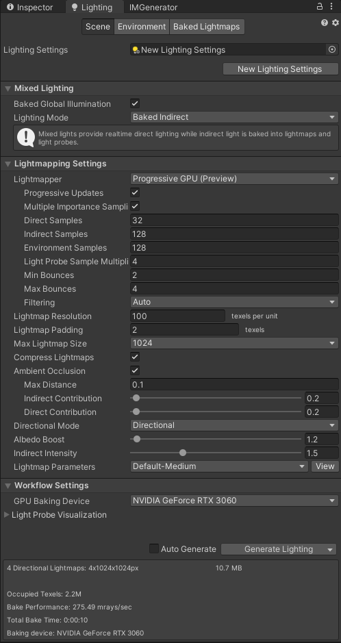
### Mixed Lighting
#### Baked Global Illumination
控制Mixed和Baked模式的光照是否启用baked GI。启用时，Mixed lights会根据具体的光照模式烘焙，而Baked lights将会被完全烘焙，不会在运行时调整。
#### Lighting Mode
指定场景中Mixed lights采用的光照模式。分为三种：
1. Baked Indirect : 只将预计算光照渲染到lightmap中，阴影采用实时光照，因此超过实时阴影的范围则不会渲染阴影。适合在较小的室内场景使用。
2. Subtractive : 进行低质量的阴影渲染，静态物体只接受来自主光的阴影投射，动态物体只接受实时光，均不考虑Light Probes等间接光。一般在不支持shadowmask的低性能平台上使用。
3. Shadowmask : 将阴影信息烘焙在Shadowmask当中，最常用。又分为 Shadowmask 和 Distance Shadowmask 两种。Shadowmask模式下所有物体都采用烘焙阴影，而Distance Shadowmask会对距离内的物体采用实时阴影，对远处物体采用烘焙阴影。
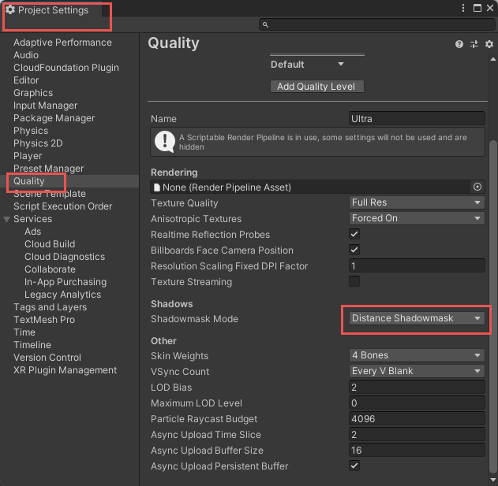
### Lightmapping Settings

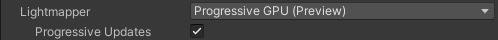
#### Lightmapper
选择Lightmap的渲染方式，分GPU和CPU两种，2021.1以前还有Enlighten模式。
#### Progressive Updates(Prioritize View)
启用后，系统优先烘焙Scene窗口可见画面，之后再烘焙其他区域。如果此时调整物体或灯光，烘焙将及时调整。使用时需要启用Auto Generate。

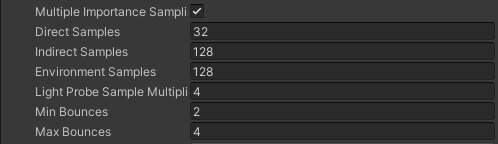
#### Multiple Importance Sampling
针对环境光采样的设置。启用后，缩短Lightmap的生成时间，但会在场景暗处生成噪点。适合快速迭代版本时使用。
#### Direct Samples
设置从每一个Texel射出的直接光照采样路径数。数值越大效果越好，烘焙越慢。
#### Indirect Samples
设置从每一个Texel射出的间接光照采样路径数。数值越大效果越好，烘焙越慢。户外场景建议值为100，室内场景可以按需求增大。
#### Environment Samples
对环境光的采样数。
#### Light Probe Sample Multipier
该数值会分别乘以以上三个采样参数，并用于对Light Probes的采样。使用前需在Project Settings -> Graphics禁用Use legacy Light Probe sample counts。 (Unity2020.3 URP 没有看见这个选项，不知道是否是移除了)
#### Min Bounces & Max Bounces
用于控制计算光子反弹次数的最小值和最大值。

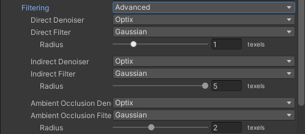
#### Filtering
设置对光照贴图的降噪处理。启用时，合并光照贴图的Direct/Indirect/AO部分前，会分别对三个部分应用降噪。

可以选择Auto和Advanced两种模式。Auto模式会根据当前设备自动为三个阶段选取降噪算法 (规则见[官方文档](https://docs.unity3d.com/Manual/progressive-lightmapper.html)) ，而Advanced模式允许自行为三个部分选取合适的降噪算法。

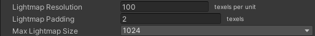
#### Lightmap Resolution
光照贴图的分辨率，单位是每单位面积的纹素。
#### Lightmap Padding
光照贴图间距。用于区分光照贴图上不同模型间UV的距离。单位是纹素。
#### Max Lightmap Size
控制单张Lightmap的最大尺寸。烘焙出的贴图可以更小。

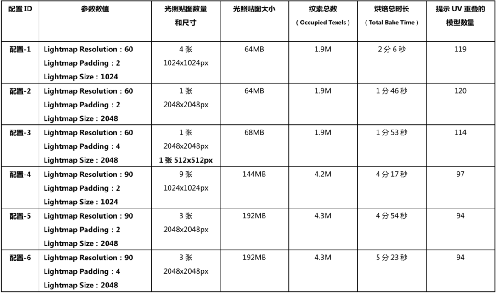

由测试数据可知，Resolution越大，烘焙结果越精细，时间越长；Padding越大，光照贴图数量越多，但可以有效减少提示UV重叠的模型数量；Size越大，光照贴图数量越少，贴图越精细。

注：提示模型UV重叠的可能性：1.模型本身UV有问题，需要在导入界面重新创建Lightmap UV或使用DCC进行修复；2.Padding过小，发生渗色。

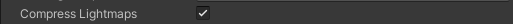
#### Compress Lightmaps
启用后压缩Lightmap，可以减少内存占用，但是会降低Lightmap质量。

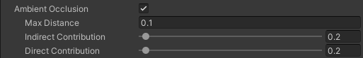
#### Ambient Occlusion
启用后将AO信息渲染到Lightmap。
#### Max Distance
控制检测AO的射线的最大检测距离，0代表无限长。
#### Indirect Contribution
控制间接光对AO的影响，值越大遮蔽越强。
#### Direct Contribution
控制直接光对AO的影响，值越大遮蔽越强。

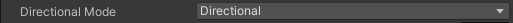
#### Directional Mode
开启时会生成第二套光照贴图，用于储存入射光的方向信息，可以在计算法线贴图时使用。占用的内存会大一倍，同时无法在SM2.0和GLES2.0硬件上使用，会退回Non-Directional模式。

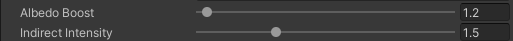
#### Albedo Boost
增加光子在物体间反射的量，基础值是1.0，值越大反射率越高。
#### Indirect Intensity
控制光照贴图中储存的间接光强度，值越大间接光越强。

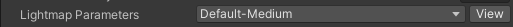
#### Lightmap Parameters
控制烘焙时的详细参数。除了在Lighting界面进行全局指定外，还能单独为每个Mesh指定参数。