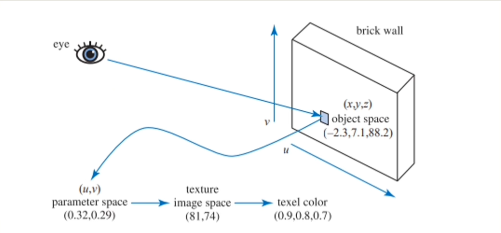
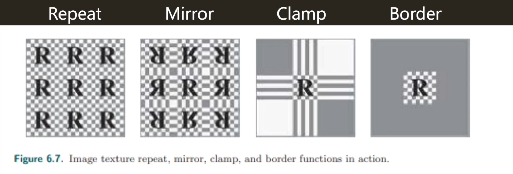
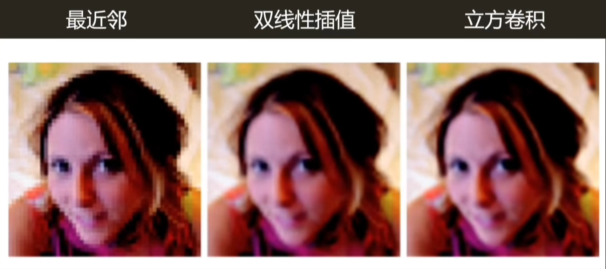

# 纹理基础

---
## 目录
* 纹理定义
* 纹理管线
* 优化与纹理应用

---
## 纹理定义
### 纹理是什么
纹理是一种可供着色器读写的结构话存储形式。以二维纹理为例，它是宽、高构成的二维数组，加上需要存储的一位信息(如RGBA值)，构成的形如Image[i][j][k]的三维数组。其中，i和j确定图像上的一个像素点，而k对应纹理在该像素点上存储的信息。

从范围上讲，纹理可以是一张任意的图片，任意存储在计算机中的图片都可以作为一张纹理。而纹理也不一定是一张图片。纹理可以存储各种信息，如高度、纹理通道、法线等。一个纹理对象，不仅仅包含具体储存的信息，也会包含纹理采样设置等。

### 纹理的意义
节省资源。

如果直接依照物品真实细节进行建模，工作量和细节处理会相当困难，而且模型保存细节所占用的存储空间会非常巨大，读取速度也很慢。

而使用纹理贴对比较粗糙的模型进行修补，虽然会损失掉一些几何细节，但是会极大的节省性能。所以纹理是一项使用图像函数或其他数据源，用以修正模型表现，从而模拟物体表面表现的技术。

---
## 纹理管线
### 纹理管线流程
**模型空间位置→投影函数→纹理映射→纹理坐标→通讯函数→新纹理坐标→纹理采样(避免依赖纹理读取)→纹理值**

投影函数：将模型表面的顶点坐标投影到纹理空间坐标(UV坐标)，一般在建模的“展UV”步骤中使用。但个别渲染方式会需要特定的投影函数，例如渲染环境贴图。

通讯函数：对纹理坐标进行平移、缩放、旋转等灵活拓展

纹理采样：用纹理坐标获取纹理上存储的值。在着色器中使用。对uv坐标的计算需要在几何着色器完成，否则会产生依赖纹理读取，影响性能。

纹理管线实例：

如图所示过程，模型空间下坐标$(-2.3,7.1,88.2)$首先被uv展开到纹理坐标$(0.32,0.29)$(采样时uv需要在$(0,1)$之间)，之后根据uv坐标在一张$256*256$的纹理上采样，得到具体的采样像素点$(81,74)$，最后根据纹理上该点对应的RGB值得到$(0.9,0.8,0.7)$
### 纹理采样设置
#### Wrap Mode
决定uv值被映射到(0,1)之外的表现。
OpenGL中称为**包装模式**(Wrapping Mode)
DirectX中称为**纹理寻址模式**(Texture Addressing Mode)

一般有四种模式：
##### Repeat
重复(0,1)的采样
##### Mirror
镜像(0,1)的采样
##### Clamp
延展(0,1)的边缘采样
##### Border
使用定值填充超出范围

#### Filter Mode
当纹理由于拉伸等产生变化而需要调整时，决定采取的滤波模式。
##### 最近邻
放大时，每个像素读取最邻近的一个像素。特征：像素化块状表现，节省性能。缩小时会造成颜色丢失和闪烁。
##### 双线性插值
找到相邻的四个像素点在二维空间上进行线性插值。特征：采样次数是最近邻的四倍，克服了不连续的缺点。缩小时会造成颜色丢失和闪烁。
##### 立方卷积插值
采样四个相邻的像素和这四个像素周围的像素(4*4)，根据距离代入不同公式进行计算插值。特征：效果更好，性能消耗大。

##### 兰索斯插值
采样8*8的范围进行复杂插值。性能消耗最大，效果最好，不常见。
##### 光滑曲线插值
在双线性插值上进行一步额外的计算，效果比双线性插值更好。

#### Mipmap
当纹理缩小时，会产生颜色丢失和闪烁。需要应用Mipmap技术降低纹理频率。

Mipmap会对纹理进行预处理，并创建数据结构，帮助解决上述问题。Mipmap构造时会以原始图像作为初始级，将$2*2$的四个像素的平均值作为下一级的新像素值，直到产生一个$1*1$的图像。如此生成的图像称为Mipmap。Mipmap会比原图像多占用1/3的存储空间。

Mipmap在纹理投射到屏幕空间，遇到各向异性的情况时(一个像素在uv方向上覆盖了不同量的纹理)，会产生采样问题。

#### 各向异性过滤
各向异性过滤是一类解决各向异性采样问题的解决思想。

##### Ripmap
按照各种长宽比例拓展Mipmap，图像大小占用是原图像的三倍。

##### 积分图Summed-Area Table

##### 重用Mipmap
Unity、UE4采取的各向异性过滤方法，直接使用Mipmap，避免了过多拓展存储空间的情况，但性能消耗高，计算代价大。

*(各向异性过滤这块知识跨度太大了，等溜完Games202之后再来补)*

---
## 优化与纹理应用
### CPU渲染优化常见方式 - 纹理图集/数组
#### 降低DrawCall
纹理显示到屏幕上时，需要CPU和GPU协同完成。CPU到GPU的渲染指令存放在一个命令队列中，CPU向其中添加指令，GPU从中获取指令。DrawCall就是CPU向GPU发出的渲染指令。

由于GPU的渲染速度是非常快的，渲染任务的完成时间往往小于CPU添加指令的速度，所以渲染的时间消耗集中在CPU添加新的DrawCall时。
#### 纹理图集
生成一条新的DrawCall时会重新赋予新的纹理。为了减少DrawCall的数量，可以将大量小的纹理组合成一张大纹理，称为纹理图集。
#### 纹理数组
思路类似于纹理图集。
### GPU渲染优化常见方式 - 纹理压缩
显存带宽指GPU对显存的读写速度。纹理太大会导致GPU到显存的传输速度慢，使GPU无法快速处理。通过硬件对纹理进行压缩和解码，可以降低纹理占用的显存大小，提高传输速度。

### 应用：立方体贴图CubeMap
使用六张二维纹理图像，构成一个以原点为中心的立方体。

对立方体纹理采样时，使用的纹理坐标是三维坐标，这个坐标被认为是一个方向向量，这个向量在立方体贴图上命中的点即采样点。

采样过程如：假设矢量$(-3.2,5.1,-8.4)$，其中$-8.4$绝对值最大，取绝对值$8.4$，选取$-Z$面进行采样，并定义一个坐标$(\frac{-3.2}{8.4},\frac{5.1}{8.4})$，放缩到$[0,1]$的范围中，得到采样坐标$(\frac{\frac{-3.2}{8.4}+1}{2},\frac{\frac{5.1}{8.4}+1}{2})$。

常用于存储环境光照信息等，用于环境贴图。
### 应用：凹凸贴图Bump Mapping
通过改变物体表面法线，在避免增加顶点的同时实现凹凸效果。

在计算光照时，不采用物体模型表面本身的法线，而是在其基础上，通过对BumpMap进行采样，得到一个扰动值进而产生一个新的法线值，再进行光照计算。

### 应用：位移贴图Displacement Mapping
类似凹凸贴图，但位移贴图实际修改了顶点位置。位移贴图的效果相对凹凸贴图更好，但前提是模型本身表面需要大量顶点以供位移，所以对模型表面三角形精度要求高。

DirectX提供了曲面细分的方法。

---
## 作业
1.Filter Mode有几种？
最近邻、双线性插值、立方卷积插值、兰索斯插值、光滑曲线插值五种。
2.纹理贴图的优化方式及原理？
1. 使用纹理图集或纹理数组，减少纹理传输数量，降低DrawCall，从CPU优化；
2. 使用纹理压缩，减小纹理占用内存大小，加快GPU到显存的传输速度，从GPU优化。