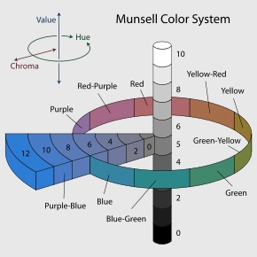
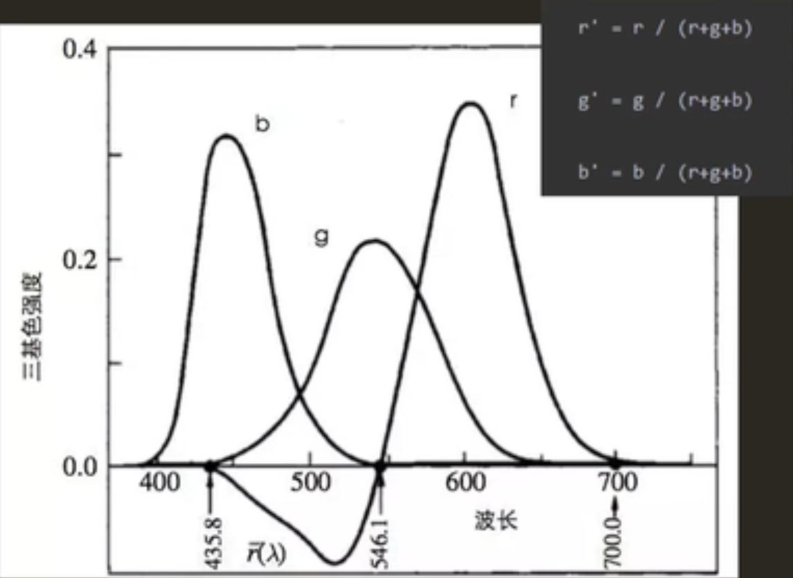
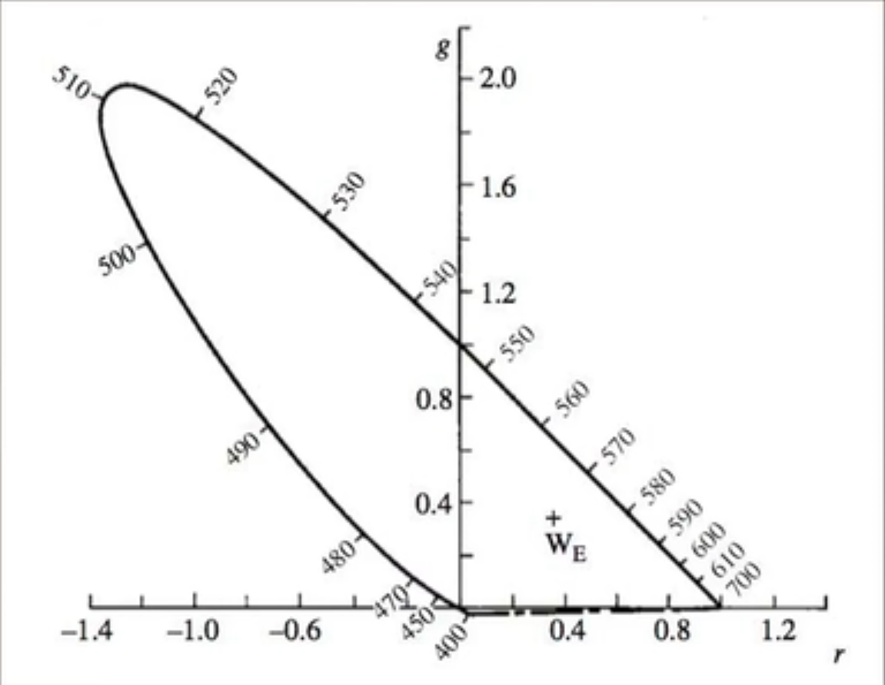
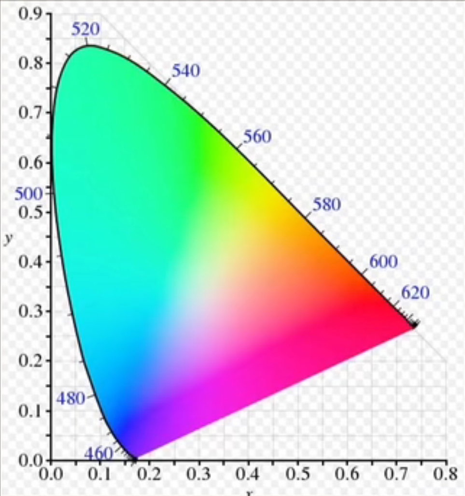
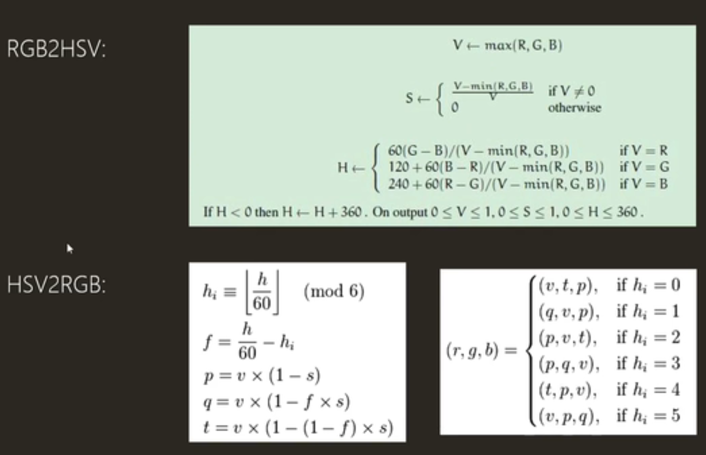

# 色彩空间基础

---
## 目录
* 色彩发送器
* 色彩接收者
* 色彩空间历史
* 常用色彩空间、色彩模型
* 色彩空间转换
* 总结

---
## 色彩发送器
### 色彩认知
色彩来自光源，光源发出光线，光线通过各种路径进入人眼，人眼将光信号转化成生物电信号发送到大脑，大脑对色彩产生认知
#### 光源
光源是产生光的物体
#### 波长
波长理论上是无限大的，人眼可见光是局限的
#### 能量分布
光是一种波，具有能量：
$$
E=\frac{hc}{\lambda}
$$
$E$为能量，$h=6.62607015×10^{-34} J·s$为普朗克常量，$c=299792458m/s$为真空光速，$\lambda$为波长
*(尘封许久的物理书突然开始攻击我)*
一个光是由多个波长的波组合形成的波形，不同的波长在人眼中呈现为不同的色彩。换言之，阐述色彩可以直接使用波长描述，但这并不符合人脑认知，所以产生了**分光光度计**的概念。
#### 分光光度计
分光光度计即光谱仪，测量范围通常是380nm~780nm的可见光区和200nm~380nm的紫外光区，将光线波长分解成光谱，用连续的颜色色谱进行标记，可以对不同波长的光进行测量。
#### 光的传播
光通过直射、反射、折射等方式传递到人眼
*(这一块直接翻高中物理书算了，多少有点乱七八糟的)*

---
## 色彩接收者
### 相对亮度感知
在阴暗环境下，如果点亮一个光源，人眼会觉得非常亮，但如果再增加大量光源，人眼只会觉得亮度有少量的提升。
### 人眼HDR
人眼既能分辨出高亮度云彩的不同层次，也可以分辨出阴影中不同物体的异同，但不一定两个功能会同时生效。

人眼可能在不同环境下，感知到不同的色彩，体验到不同的阴影效果。
### 人眼感光细胞分布
人眼中感受光线的细胞分为两种：视杆细胞和视锥细胞。视杆细胞负责感知光强，而视锥细胞负责感知色彩。

人眼的视杆细胞数量远大于视锥细胞，因此人眼可以很容易感知到光线亮度的变化。(原因：https://www.bilibili.com/video/BV1yU4y1X7kC)
### 视锥细胞
人眼中通常有三种视锥细胞(有些四种)，分为L、M、S三种，分别对R、G、B色彩进行感知
### 人眼的本质
接受外部光线的光信号，转化为生物电信号输入到大脑的器官
### 微积分公式
$$
C=\int S(\lambda)\cdot I(\lambda)\cdot R(\lambda)d\lambda
$$
$C$为值得人眼输出的神经电信号，$S(\lambda)$为LMS三种视锥细胞的分布，$I(\lambda)$为光源的功率谱分布，$R(\lambda)$为反射物体的吸收功率分布

---
## 色彩空间历史
### 19世纪 色彩的猜想
1. 人眼有100多种感色细胞
2. 人眼有三种，分别感受RGB的感色细胞
3. 人眼有三种，分别感受黑白、红绿、黄蓝的感色细胞

其中2、3猜想均成为了当下的色彩模型。
### 1905 Munsell色彩系统
美国艺术家Albert Henry Munsell在1905年提出最早的色彩系统，后再1930年被改良。他使用了很多色卡组成的柱体来描述色彩，绕柱轴旋转角度描述色相，垂直高度描述亮度，截面半轴描述饱和度，构成了一个HSL(色相饱和亮度)色彩系统。

这是一套基于艺术的归纳总结规范，而非物理科学的研究，可以很容易描述一个感受的颜色。这一系统解决了对色彩描述模糊的难题，任意一个颜色可以使用$H=x,V=y,C=z$进行描述。
### 1931 RGB Color Specification System
由于Munsell色彩系统对色彩的描述并非基于物理客观的科学阐述，一个名为CIE的机构在1931年建立了RGB Color Specification System，希望完全客观完全物理的量化色彩。

CIE通过对可视波长的光线进行完全测量，得到了r,g,b三条色彩曲线，并对测量结果进行归一化，保证色彩值在$-1\thicksim 1$之间，并使得r'+g'+b'=1，从而利用其中两个参数便可以描述第三个值，产生一个色彩的二维空间，以r'为X轴，g'为Y轴，从而在科学上对色彩进行了真正的定义。

### 1931 XYZ Color Specification System
由于RGB色彩系统存在负数，不便于计算，人们使用数学定义了一个新的色彩空间：
$$
\begin{bmatrix}
    x\\
    y\\
    z\\
\end{bmatrix}=\begin{bmatrix}
    2.7689&1.7517&1.1302\\
    1.0000&4.5907&0.0601\\
    0.0000&0.0565&5.5943\\
\end{bmatrix}\cdot\begin{bmatrix}
    R\\
    G\\
    B\\
\end{bmatrix}
$$
*注意：此处的RGB并非sRGB，而是CIE 1931RGB*
并对X，Y，Z进行归一化：
$$\begin{aligned}
x=&\frac{X}{X+Y+Z}\\
y=&\frac{Y}{X+Y+Z}\\
z=&\frac{Z}{X+Y+Z}\\
=&1-x-y\\
\end{aligned}$$
最终得到的色彩空间是色域马蹄图

由于xy并没有描述图像的亮度，所以在归一化的基础上，用XYZ中的Y构成了Yxy色彩空间

XYZ色彩空间存在的问题是：它的色彩分布并不均匀。
### 色彩空间的定义
色彩空间至少需要满足三项重要指标：
1. 色域(三个基色的坐标，由此形成三角形)
2. Gamma(如何对三角形内进行切分)
3. 白点(色域三角形中心)

#### Gamma
Gamma并不是色彩空间，是一种描述如何对色彩采样的方式。

每次对比顶点切割，就会发现：切割的方式不同会导致每次对应的颜色不一样。$gamma=1$指代的是均匀切分，好处是方便计算。

而非均匀切割的方式是$gamma\neq 1$。gamma值越大，对高饱和度区域的描述越充分。

---
## 常用色彩模型与色彩空间
### 色彩模型
使用一定规则描述(排列)颜色的方法。如：RGB、CMYK、LAB
### 色彩空间
至少需要三个指标：色域、gamma、白点，如：CIE XYZ、Adobe RGB、sRGB、Japan Color 2001 Uncoated、US Web Coated(后两者基于CMYK模型建立)
## 色彩空间转换

## 作业
**色彩空间的定义是什么？**
满足三个指标：1.色域；2.gamma；3.白点
**人眼的可见光范围是多少？**
380nm~780nm