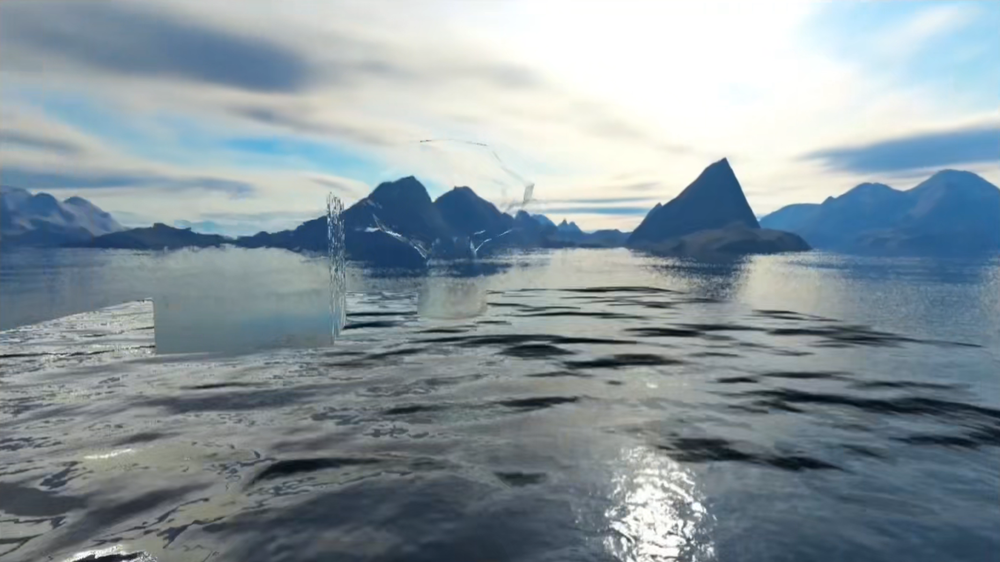

# 模型与材质
---
## 目录
* 渲染管线与模型基础
* 材质基础
* 模型数据解析

---
## 渲染管线与模型基础
### 图形渲染管线
顶点数据(vertex data)→顶点着色器(vertex shader)→形状(图元)装配(shape assembly)→几何着色器(geometry shader)→光栅化(rasterization)→片段着色器(fragment shader)→测试与混合(test and blending)
### 模型实现原理
根据顶点渲染各个面，然后渲染形成多边形，最后渲染颜色，实现模型。
### UV
uv是将模型的各个面划开，平铺在一个二维坐标系当中。上面的每个顶点都与三维空间一一对应，二维坐标系的顶点对应的位置就是顶点的纹理坐标。

每个顶点都能利用纹理坐标获取到贴图所存储的信息。

在建模软件中，对模型进行uv展开，uv会放在一个横向为u，纵向为v，范围(0,1)的二维坐标系当中。展开后就能利用uv进行贴图的绘制。
### 模型包含的信息(OBJ)
#### V顶点坐标数据(Vertex)
模型空间中单个顶点的XYZ坐标
    
    v 1.000000 1.000000 -1.000000
    v 1.000000 -1.000000 -1.000000
    v 1.000000 1.000000 1.000000
    v 1.000000 -1.000000 1.000000
    v -1.000000 1.000000 -1.000000
    v -1.000000 -1.000000 -1.000000
    v -1.000000 1.000000 1.000000
    v -1.000000 -1.000000 1.000000
#### VT贴图坐标(Vertex Texcoord)
uv坐标

    vt 0.625000 0.500000
    vt 0.875000 0.500000
    vt 0.875000 0.750000
    vt 0.625000 0.750000
    vt 0.375000 0.750000
    vt 0.625000 1.000000
    vt 0.375000 1.000000
    vt 0.375000 0.000000
    vt 0.625000 0.000000
    vt 0.625000 0.250000
    vt 0.375000 0.250000
    vt 0.125000 0.500000
    vt 0.375000 0.500000
    vt 0.125000 0.750000
#### VN顶点法线(Vertex Normal)
    vn 0.0000 1.0000 0.0000
    vn 0.0000 0.0000 1.0000
    vn -1.0000 0.0000 0.0000
    vn 0.0000 -1.0000 0.0000
    vn 1.0000 0.0000 0.0000
    vn 0.0000 0.0000 -1.0000
#### 顶点色(Color)
单个顶点的RGBA通道颜色信息(OBJ不包含顶点色)
### OBJ与FBX对比
| # | obj格式 | fbx格式 | 备注 |
| :---- | :---- | :---- | :---- |
| 多个object | 支持 | 支持 | 在文件中存放多个三维模型 |
| 单object拥有多个材质 | 支持 | 支持 | |
| Polygons面 | 支持 | 支持 | 易于被3ds max等软件编辑加工 注：导入到ue4时必须为三角形面 |
| Normal | 支持 | 支持 | |
| Material | 支持 | 支持 |
| 光滑组(Smoothing Group) | 支持 | 支持 | 光滑组中的点或面使用平均法线来计算光照，使得整个mesh区域看起来更平滑 |
| uv套数 | 1 | 多套 | |
| 顶点Color | 不支持 | 支持 | 导入ue4时，Vertex Color Import Option设置为Replace |
| ue4 lod | 不支持 | 支持 | 导入ue4时，勾选Import Mesh LODs |
| ue4 simple collision | 支持 | 支持 | 任意凸体碰撞命名规则：UCX_[RenderMeshName]，UCX_[RenderMeshName]_00 |
| socket插槽 | 不支持 | 支持 | 命名规则：SOCKET_[RenderMeshName]，SOCKET_[RenderMeshName]_01 |
| skeleton骨骼 | 不支持 | 支持 | |
| skeletal mesh 网格 | 不支持 | 支持 | |
| animation sequence | 不支持 | 支持 | |

---
## 材质基础
### 材质
不同物体的反光不同。有些物体反光时不会有太多散射(Scatter)，因此高光点较小，而有些物体会产生较多散射，因此高光点更大。
#### 漫反射
漫反射是最容易模拟的模型。最简单的Lambert认为光线均匀的反射出去。
#### 镜面反射
镜面反射是将入射光线根据表面法线进行反射，并且只在反射方向有出射光。
#### 折射
一部分光除了反射还会折射进入物体之中。反射和折射能量的多少根据Fresnel定律决定。折射率决定了光线进入物体后的偏折角度。
#### 粗糙镜面反射
在镜面反射的基础上有少量的法线偏移，反射光线仍然集中在某个区域，形成类似磨砂的质感。
#### 粗糙镜面折射
类似镜面反射，反射光线和折射光线都分别集中在某个区域。类似毛玻璃。
#### 多层材质
除了物体本身一个材质外，表面还有一个半透的其他材质。光线进入会先进行一次反射和折射，再进行一次反射。类似清漆木料和浅水。
#### 次表面散射
次表面散射通常发生在半透明物体。光线能够进入物体内部并进行多次反射，最后反射出去。类似玉石、蜡烛、牛奶、皮肤。
##### 多层皮肤模型
把皮肤看成三层：油脂层(微量，很薄)、表皮层、真皮层。

油脂层直接把光反射出去，产生皮肤表面高光。

一部分光折射进入子表面层，光进入这些层后部分被吸收(获得颜色)和散射，再从皮肤中入射点附近的出射点射出，产生次表面散射的效果。
### 改变材质表面
现实中不存在绝对光滑的表面，而一个模型顶点的法线数据有限，因此使用法线贴图可以补充漫反射、高光、折射等计算。

材质与模型的表现是相辅相成的，有时，模型本身就能表现出物体本身的质感，而加入材质就能给人更直观的感受。

---
## 模型数据解析
### 模型数据在渲染中的作用
#### 纹理动画
在渲染的过程中改变纹理坐标，使采样时发生偏移，以此达到动画的效果。
##### 水面效果

水面实现分为光照计算和折射透过后方物体两个部分。
###### 光照计算
1. 利用法线贴图修改反射和折射的朝向，得到水面的波纹。
2. 改变uv采样点的位置，产生动画效果。
###### 折射后方物体
1. 渲染并采样后方物体，将水面表面与采样结果混合。

#### 顶点动画
在顶点着色器中，对模型的顶点进行操作，进而产生动画效果。

在一些三维建模软件中，动画k帧也可以理解为一种顶点动画。
#### 顶点色
模型顶点带有的颜色，渲染过程中可以通过顶点色进行控制

模型各点颜色是根据顶点色插值得到的。一般的游戏引擎会把模型的面细分为若干三角形。计算插值时，通过计算三角形重心得到。
#### 顶点法线与面法线
面法线本质上还是顶点法线，只是存储方式不同。

未使用平滑时，采用面法线，三角形三个顶点共用一个法线。插值时，因为三个顶点的法线相同，所以同一平面插值的结果相同。

使用平滑后，采用顶点法线，每个顶点一个法线，三角形三个顶点法线各不相同，插值结果也会产生不同。

## 作业
顶点色还可以做什么？
用于控制颜色范围，如卡通渲染的阴影、高光。
模型光滑组对法线有什么影响？
使用顶点法线，插值计算法线时更平滑。